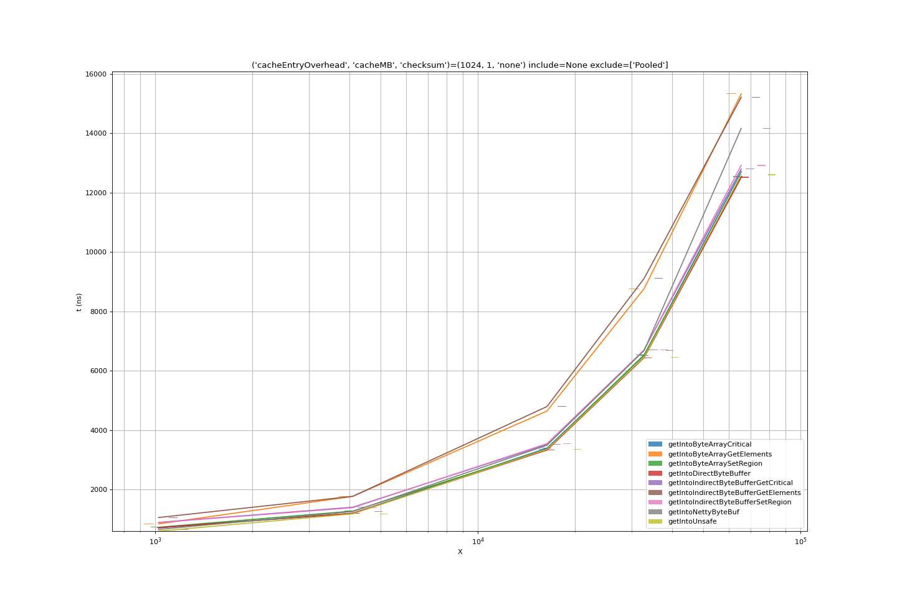
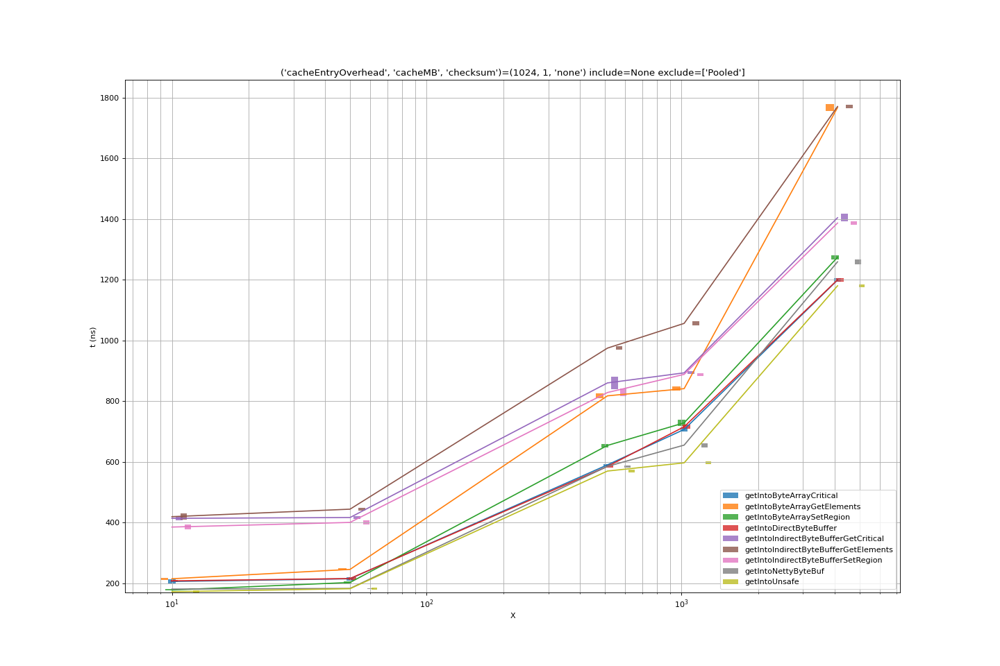
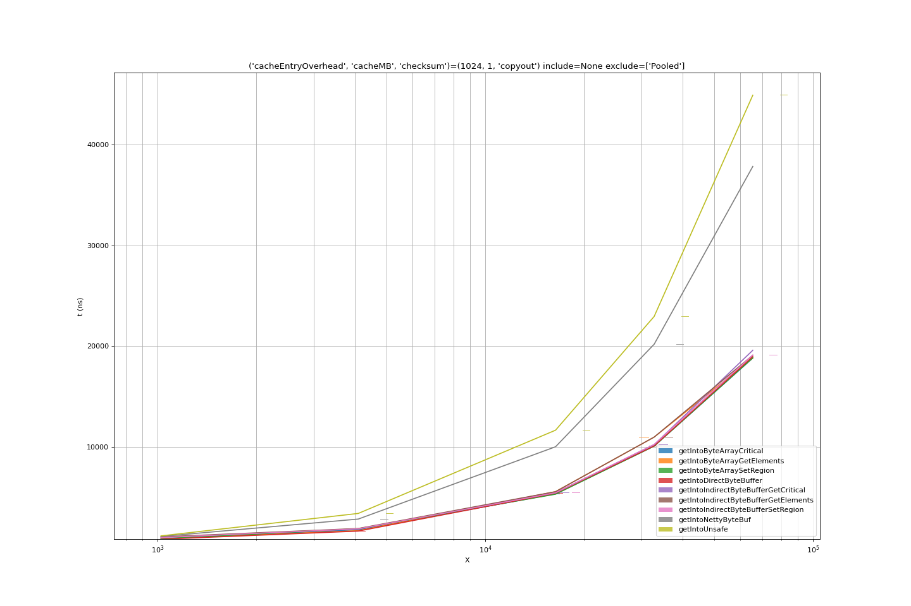

# Data Transfer Benchmarks

This is an evolution or adaptation of the original benchmarks, to focus on
efficiency of data transfer across JNI, and to try to as accurately as possible
simulate the real loads involved in calling a database implemented in `C++` from
Java, and transferring data in either direction across the JNI interface.

## The Model

- In `C++` we represent the on-disk data as an in-memory map of `(key, value)`
  pairs.
- For a fetch query, we expect the result to be a Java object with access to the
  contents of the _value_. This may be a standard Java object which does the job
  of data access (a `byte[]` or a `ByteBuffer`) or an object of our own devising
  which holds references to the value in some form (a `FastBuffer` pointing to
  `com.sun.unsafe.Unsafe` unsafe memory, for instance).

### Data Types

There are several potential data types for holding data for transfer, and they
are unsurprisingly quite connected underneath.

#### Byte Array

The simplest data container is a _raw_ array of bytes.

```java
byte[]
```

There are 3 different mechanisms for transferring data between a `byte[]` and
C++

- At the C++ side, the method
  [`JNIEnv.GetArrayCritical()`](https://docs.oracle.com/en/java/javase/13/docs/specs/jni/functions.html#getprimitivearraycritical)
  allows access to a C++ pointer to the underlying array.
- The `JNIEnv` methods `GetByteArrayElements()` and `ReleaseByteArrayElements()`
  fetch references/copies to and from the contents of a byte array, with less
  concern for critical sections than the _critical_ methods, though they are
  consequently more likely/certain to result in (extra) copies.
- The `JNIEnv` methods `GetByteArrayRegion()` and `SetByteArrayRegion()`
  transfer raw C++ buffer data to and from the contents of a byte array. These
  must ultimately do some data pinning for the duration of copies; the
  mechanisms may be similar or different to the _critical_ operations, and
  therefore performance may differ.

#### Byte Buffer

This container abstracts the contents of a collection of bytes, and was in fact
introduced to support a range of higher-performance I/O operations in some
circumstances.

```java
ByteBuffer
```

There are 2 types of byte buffers in Java, _indirect_ and _direct_. Indirect
byte buffers are the standard, and the memory they use is on-heap as with all
usual Java objects. In contrast, direct byte buffers are used to wrap off-heap
memory which is accessible to direct network I/O. Either type of `ByteBuffer`
can be allocated at the Java side, using the `allocate()` and `allocateDirect()`
methods respectively.

Direct byte buffers can be created in C++ using the JNI method
[`JNIEnv.NewDirectByteBuffer()`](https://docs.oracle.com/en/java/javase/13/docs/specs/jni/functions.html#newdirectbytebuffer)
to wrap some native (C++) memory.

Direct byte buffers can be accessed in C++ using the
[`JNIEnv.GetDirectBufferAddress()`](https://docs.oracle.com/en/java/javase/13/docs/specs/jni/functions.html#GetDirectBufferAddress)
and measured using
[`JNIEnv.GetDirectBufferCapacity()`](https://docs.oracle.com/en/java/javase/13/docs/specs/jni/functions.html#GetDirectBufferCapacity)

#### Unsafe Memory

```java
com.sun.unsafe.Unsafe.allocateMemory()
```

The call returns a handle which is (of course) just a pointer to raw memory, and
can be used as such on the C++ side. We could turn it into a byte buffer on the
C++ side by calling `JNIEnv.NewDirectByteBuffer()`, or simple use it as a native
C++ buffer at the expected address, assuming we record or remember how much
space was allocated.

Our `FastBuffer` class provides access to unsafe memory from the Java side; but
there are alternatives (read on).

### Allocation

A separate concern to the cost of transferring data across JNI (and associated
copying) is the allocation of the memory within which the transferred data is
contained. There are many models for how data is allocated, freed and
re-allocated, and these have a major influence on overall performance. In order
to focus on measuring JNI performance, wee want to make data/memory allocation
consistent. Current tests mix allocation types:

- Allocate data on the Java side for every call (be it `byte[]`, direct or
  indirect `ByteBuffer`, or unsafe memory)
- Allocate data on the C++ side for every call (be it `byte[]`, direct or
  indirect `ByteBuffer`, or unsafe memory)
- Allocate a data container on the Java side, and re-use it for every call (this
  works better for `get()` then `put()`)
- Return direct memory from the C++ side, wrapped in a mechanism that allows it
  to be unpinned when it has been read/used

In testing multiple JNI transfer options, we need to consistently use the same
allocation patterns so that they do not impact the JNI measurements, and so that
when we d owant to compare allocation patterns we can do that clearly in
isolation.

#### `get()` Allocation

For the cases where the client supplies the buffers (i.e. `get()` some data and
place it in this buffer) we will pre-allocate a configured amount of space, in
the buffer size configured for the test, and use that in a circular fashion. The
conceit is that we are simulating filling our caches with the data reequested.

For the cases where the buffers are generated by the called function (it creates
a `byte[]` or a `ByteBuffer`), we will benchmark the case where the C++ side
calls JNI functions to allocate and fill these objects.

We need to benchmark the product of `byte[]` allocation mechanisms and of
`byte[]` writing mechanisms to understand all cases. We do suspect, based on
experience and some initial evidence, that the cases where the method allocates
the `byte[]` with every call, will be much slower.

An alternative mechanism which may be worth investigating is for the C++ side to
configurably pre-allocate `byte[]`s, in a way configured by a setup call over
JNI. Then the C++ side can maintain a pool of `byte[]`s with which to
immediately satisfy a `get()` request, handing the ownership of individual
`byte[]`s back to the caller of `get()`, and refreshing the pool.

- Is this something that would be feasible/sensible to implement for _RocksDB_
  JNI layer ?
- Does the _RocksDB_ JNI layer hold global context that we can hook this to ?

#### `put()` Allocation

Unlike for `get()`, callers to `put()` must have allocated some form of storage
containing the data to be written. Hopefully this reduces the problem space of
testing a little. We still need to make 2 sorts of tests:

1. Allocation of a pool of buffers during benchmark setup, which focuses on
   benchmarking the basic `JNI` task of crossing the language boundary and
   moving data into the `C++/RocksDB` world.

2. Allocation done at the time of writing; do users typically allocate buffers
   at this time ? For example, on clicking save in a visual application, is the
   upshot to collapse an exploded XML structure into a text buffer and `put()`
   that buffer to the database ?

All cases of `put()` will work the same, as we have to supply the data on the
Java (client) side. As for client-supplied buffers in `get()`, we will
pre-allocate a fixed pool of buffers and borrow these from the pool.

#### Testing Allocation Performance

Allocation performance, based on the combination and interaction of the user's
usage and the library code's usage is an important factor of real world
performance.

It is important to 1st test the JNI approach itself (i.e. without allocation -
where possible), and then 2nd repeat that test (as a separate test) but to
incorporate the different allocation strategies that a user might take.

There are some different potential scenarios:

- The user allocates new `byte[]`s for every call to `get()/put()`
- The user re-uses buffers in some way, e.g. as a thread local
- What does the user do when their buffer is not large enough for a `get()` ? Do
  they allocate a new one and throw away the old one, or have some variable
  buffer pooling?

#### Disposal of returned direct `ByteBuffer`s

If we decide that a direct `ByteBuffer` is a good mechanism for our JNI calls
(by reason of performance) then we may wish to extend our code to implement a

```java
class UnsafeDirectByteBuffer implements AutoClosable {
    void close() {
        // free the unsafe buffer in our allocation mechanism
    }
}
```

### Copy and Transfer Mechanisms

The options for how to transfer data between Java and C++ structures depend on
the data allocation types used. For some allocation types there are multiple
options.

#### `JNIEnv->GetPrimitiveArrayCritical` for `byte[]`

This method is used to get a C++ pointer from a Java array, which can then be
transferred using `memcpy()`, within a short critical section, before closing
with `ReleasePrimitiveArrayCritical`

#### `JNIEnv->Get/SetByteArrayRegion` for `byte[]`

Abstracted method for transferring data to/from a Java array, presumably it uses
the critical section method underneath. We can confirm this with performance
tests.

#### `JNIEnv->GetDirectBufferAddress` for direct `ByteBuffer`

This returns a pointer with which we can `memcpy()` into or out of the buffer
according to the operation we are performing.

#### `byte[] ByteBuffer.array()` for indirect `ByteBuffer`s ?

The `byte[] array()` method is optional, but if it returns non-null we can then
do `byte[]`-oriented operations. Then (as in the current tests), `SetByteArray`
is used to fill the `ByteBuffer`. One question is when it might fail ?

Are there any alternatives if it does fail ?

#### Unsafe memory and the homebrew `FastBuffer` wrapper

Related Evolved Binary JNI performance work has built a `FastBuffer` class which
wraps the contents of unsafe memory with a `ByteBuffer` API. This can be tested
and compared against wrapping the memory into a `ByteBuffer` (below).

#### Unsafe memory wrapped into a direct `ByteBuffer`

As the unsafe memory handle is an address on the `C++` side, we can use
`JNIEnv->NewDirectByteBuffer()` to turn it into a `ByteBuffer`, fill it
appropriately, and then return the `ByteBuffer` across the JNI interface where
it will be readable using the standard Java `ByteBuffer` API.

Questions.

1. Does it work if the memory is allocated by both Unsafe in Java, or by C++ new
   ?
2. What is the ownership is for the memory pointed to by DirectByteBuffer ?
   isn't it the case that Java will free that memory when GC happens on
   DirectByteBuffer - if that is the case, it makes it unsuitable to use it for
   wrapping an existing C++ pointer - for example the char\* of a
   rocksdb::Slice. -- but maybe we don't do that yet? If not that might be an
   interesting use-case, i.e. pin the rocksdb::Slice via PinnableSlice and then
   give the pointer back to Java, we would need a close (i.e. un-pin) mechanism
   as well on whatever Object wraps that in Java.

The `unpin()` mechanism described is basically the same as the for Evolved
Binary's `FastBuffer` class which wraps unsafe memory and releases it when the
buffer is unpinned. The flow is familiar; an object (the buffer)'s ownership is
transferred to the caller on return from the call, and is released explicitly
some time later, when the caller is done with it.

### Processing/Generation

Part of the cost of any real-world use case of the JNI is the processing of the
contents of the returned data. We want to be assured that accessing the contents
of the data is not particularly slow because of how it is stored. To do this, we
will include a minimal processing phase (`get()`) and generation phase (`put()`)
in our benchmarks.

A reasonable processing phase would be a simple bytewise checksum of the
contents of the result. We might also want to explore what difference using a
64-bit word oriented calculation would make to this. The checksum calculation
needs to be simple enough to be trivially implemented over all the containers we
use, including at least `ByteBuffer`, `FastBuffer` or `byte[]`.

A generation phase could be the bytewise or wordwise filling of the container to
be "written" with increasing integers.

## Test Methods

We have tested `get()` methods extensively, and the results seeem credible based
on what we are testing and how we theorise that the performance works.

```java
    public static native ByteBuffer getIntoDirectByteBufferFromUnsafe(
            final byte[] key,
            final int keyOffset,
            final int keyLength,
            final long bufferHandle,
            final int valueLength);

    public static native int getIntoUnsafe(
            final byte[] key,
            final int keyOffset,
            final int keyLength,
            final long bufferHandle,
            final int valueLength);

    public static native int getIntoDirectByteBuffer(
            final byte[] key,
            final int keyOffset,
            final int keyLength,
            final ByteBuffer value,
            final int valueLength);

    public static native int getIntoIndirectByteBufferSetRegion(
            final byte[] key,
            final int keyOffset,
            final int keyLength,
            final ByteBuffer value,
            final int valueLength);

    public static native int getIntoIndirectByteBufferGetElements(
            final byte[] key,
            final int keyOffset,
            final int keyLength,
            final ByteBuffer value,
            final int valueLength);

    public static native int getIntoIndirectByteBufferGetCritical(
            final byte[] key,
            final int keyOffset,
            final int keyLength,
            final ByteBuffer value,
            final int valueLength);

    public static native int getIntoByteArraySetRegion(
            final byte[] key,
            final int keyOffset,
            final int keyLength,
            final byte[] value,
            final int valueLength);

    public static native int getIntoByteArrayGetElements(
            final byte[] key,
            final int keyOffset,
            final int keyLength,
            final byte[] value,
            final int valueLength);

    public static native int getIntoByteArrayCritical(
            final byte[] key,
            final int keyOffset,
            final int keyLength,
            final byte[] value,
            final int valueLength);
}
```

Our testing of `put()` has been less complete than that of `get()`, but we can
stll draw some conclusions.

```java
    public static native int putFromUnsafe(
            final byte[] key,
            final int keyOffset,
            final int keyLength,
            final long bufferHandle,
            final int valueLength);

    public static native int putFromDirectByteBuffer(
            final byte[] key,
            final int keyOffset,
            final int keyLength,
            final ByteBuffer value,
            final int valueLength);

    public static native int putFromIndirectByteBufferGetRegion(
            final byte[] key,
            final int keyOffset,
            final int keyLength,
            final ByteBuffer value,
            final int valueLength);

    public static native int putFromIndirectByteBufferGetElements(
            final byte[] key,
            final int keyOffset,
            final int keyLength,
            final ByteBuffer value,
            final int valueLength);

    public static native int putFromIndirectByteBufferGetCritical(
            final byte[] key,
            final int keyOffset,
            final int keyLength,
            final ByteBuffer value,
            final int valueLength);

    public static native int putFromByteArrayGetRegion(
            final byte[] key,
            final int keyOffset,
            final int keyLength,
            final byte[] value,
            final int valueLength);

    public static native int putFromByteArrayGetElements(
            final byte[] key,
            final int keyOffset,
            final int keyLength,
            final byte[] value,
            final int valueLength);

    public static native int putFromByteArrayCritical(
            final byte[] key,
            final int keyOffset,
            final int keyLength,
            final byte[] value,
            final int valueLength);
```

All the test methods we benchmark are accessed via JNI headers in
`com.evolvedbinary.jnibench.common.getputjni.GetPutJNI.java` and implemented in
`GetPutJNI.cpp`.

## Results

### Organisation

The directory `./analysis` has been added to the repository; within each
directory you will find the `.md` and the `.csv` file for a run controlled by
`./jmhrun.py`. So the get benchmarking run we are discussing here is recorded in
`./analysis/get_benchmarks`. The directory also contains a set of plots, which
can be regenerated:

```
$ cd .../jni-benchmarks
$ ./jmhplot.py --config jmh_plot.json --file analysis/get_benchmarks
```

#### Allocation

For these benchmarks, allocation has been excluded from the benchmark costs by
pre-allocating a quantity of buffers of the appropriate kind as part of the test
setup. Each run of the benchmark grabs an existing buffer from the pre-allocated
FIFO list which has been set up, and returns it afterwards. We ran a small test
to confirm that the request and return cycle is of insignficant cost compared to
the benchmark API call.

### GetJNIBenchmark

These benchmarks are distilled to be a measure of

- Carry key across the JNI boundary
- Look key up in C++
- Get the resulting value into the supplied buffer
- Carry the result back across the JNI boundary

Comparing all the benchmarks as the data size tends large, the conclusions we
can draw are:

- Benchmarks ran for a duration of order 6 hours on an otherwise unloaded VM,
  the error bars are small and we can have strong confidence in the values
  derived and plotted.
- `GetElements` methods for transferring data from C++ to Java are consistently
  less efficient than other methods.
- Indirect byte buffers are pointless; they are just an overhead on plain
  `byte[]` and the JNI-side only allows them to be accessed via their
  encapsulated `byte[]`.
- `SetRegion` and `GetCritical` mechanisms for copying data into a `byte[]` are
  of very comparable performance; presumably the behaviour behind the scenes of
  `SetRegion` is very similar to that of declaring a critical region, doing a
  `memcpy()` and releasing the critical region.
- Getting into a raw memory buffer, passed as an address (the `handle` of an
  `Unsafe` or of a netty `ByteBuf`) is of similar cost to the more efficient
  `byte[]` operations.
- Getting into a direct `nio.ByteBuffer` is of similar cost again; while the
  ByteBuffer is passed over JNI as an ordinary Java object, JNI has a specific
  method for getting hold of the address of the direct buffer, and this done the
  `get()` cost is effectively that of the `memcpy()`.

.

At small(er) data sizes, we can see whether other factors are important.

- Indirect byte buffers are the most significant overhead here. Again, we can
  conclude that we want to discount them entirely.
- At the lowest data sizes, netty `ByteBuf`s and unsafe memory are marginally
  more efficient than `byte[]`s or (slightly less efficient) direct
  `nio.Bytebuffer`s. This may perhaps be explained by even the small cost of
  entering the JNI model in some fashion on the C++ side simply to acquire a
  direct buffer address. The margins (nanoseconds) here are extremely small.

.

#### Post processing the results

Our benchmark model for post-processing is to transfer the results into a
`byte[]`. Where the result is already a `byte[]` this may seem like an unfair
extra cost, but the aim is to model the least cost processing step for any kind
of result.

- Copying into a `byte[]` using the bulk methods supported by `byte[]`,
  `nio.ByteBuffer` are comparable.
- Accessing the contents of an `Unsafe` buffer using the supplied unsafe methods
  is very inefficient. These methods do not seem optimized for this use case.
- Accessing the contents of a netty `ByteBuf` (awaiting results - not as fast as
  hoped)

.

#### Conclusion

Performance analysis shows that for `get()`, fetching into allocated `byte[]` is
just as efficient as any other mechanism. Copying out or otherwise using the
result is straightforward and efficient. Using `byte[]` avoids the manual memory
management required with direct `nio.ByteBuffer`s, which extra work does not
appear to provide any gain. A C++ implementation using the `GetRegion` JNI
method is probably to be preferred to using `GetCritical` because while their
performance is equal, `GetRegion` abstracts slightly further the operations we
want to use.

Vitally, whatever JNI transfer mechanism is chosen, the buffer allocation
mechanism and pattern is crucial to achieving good performance. We experimented
with making use of netty's pooled allocator part of the benchmark, and the
difference of `getIntoPooledNettyByteBuf`, using the allocator, compared to
`getIntoNettyByteBuf` using the same pre-allocate on setup as every other
benchmark, is significant.

.

### PutJNIBenchmark

These benchmarks are distilled to be a measure of

- Carry key across the JNI boundary
- Carry data across he JNI boundary
- Look up slot for key up in C++
- Copy the data into the buffer slot
- Return over the JNI boundary

Comparing the put benchmarks we see a serious divergence between
`GetElements`-based operations, and others. It is much more pronounced than for
`get()`, and the large gap is not immediately explicable.

- Is the benchmark not doing something it should ? This seems possible, given it
  is newly written, and we should add some validation that operations are really
  happening.
- Within the clusters of results, we still see the same trends as before.
- The netty buffers `ByteBuf` and `Unsafe` memory are the most efficient sources
  of data, but they are not significantly faster than using a simple `byte[]`
  with a `SetRegion` JNI call, and for the simplicity and generality of the
  interface a `byte[]` should be preferred.

.

Analysing for smaller data values, as for `get()` we see that netty `ByteBuf`
and `Unsafe` memory are the most efficient. Again the benefit over simple
`byte[]` use is very marginal, surely not worth the complexity.

.

#### Pre processing the data

The `put()` equivalent of post-processing is pre-processing, and we choose to do
this by filling the buffer with a constant value as efficiently as we can.

TBD

### Further Work

As we have argued above, we have fairly robust results for `get()`, with the
exception of copying out for netty `ByteBuf`s. Our results for `put()` are more
questionable, but do seem to confirm certain aspects of the `get()` results.

- Check/confirm/refute `get()` into netty `ByteBuf` copyout results.
- Check/confirm/refute `put()` results for operations other than
  `GetElements`-based ones.

## Running and Developing Tests

This is by way of an Appendix, and describes how to recreate the results, and
run modified benchmarks, as easily as possible.

### Check out the repository

We developed in the branch
`https://github.com/alanpaxton/jni-benchmarks/tree/getvaluesimulation` So

```
$ git clone https://github.com/alanpaxton/jni-benchmarks
$ cd jni-benchmarks
$ mvn clean compile package
```

### How to run a test

In the `jni-benchmarks` directory

```
$ mkdir results
$ ./jmhrun.py
```

This should result in a short example benchmark being run, and producing a
`jmh_<datestamp>.md` file and a `jmh_<datestamp>.csv` file in `./results`.

- `JMH` tests are written in Java, `jmhrun.py` is a wrapper for invoking a JMH
  benchmark/group of benchmarks in a configured and repeatable way.
- You can look in the `jmh.json` file to see how the test is configured. This
  configuration covers JMH benchmark parameters, JMH options, passing JVM
  parameters etc.
- The `jmh_<datestamp>.md` file is generated at the start of the run, and
  documents the configuration it was invoked with.
- You can use another configuration file to run a different test, without having
  to rebuild the Java, or set it up in the IDE, although that of course is
  possible.
- We conventionally run bigger tests using
  `./jmhrun.py --config jmh_full_run.json` but obviously you can have as many
  different configurations sitting around as is useful to you.
- The `jmh_<datestamp>.csv` is in JMH's CSV output format, and can be analysed
  using `./jmhplot.py` (see next)

### How to analyse a test

Analysis is a separate step, based on the output CSV file `jmh_<datestamp>.csv`.
The command

```
jmhplot.py --config jmh_plot.json --file <path>/<to>/jmh_<datestamp>.csv
```

will create a series of plots (`.png`s) as configured by the config file, and
will save these plots as siblings of the CSV file. It is set up to slice and
dice in several dimensions.

Typically, the plots will have the `valueSize` on the x-axis, and `time` on y,
with a line for every benchmark. Plots are duplicated for each of the different
values of the other parameters of the benchmark, so there will be a plot for
`checksum=none`, a plot for `checksum=copyout` etc.

- Look at `jmh_plot.json` to see what you can configure.

### Development in IntelliJ

`GetJNIBenchmark` can be run/debugged in IJ. This is a much quicker and more
pleasant way of working than using command line all the time. Things I did to
make this work include:

- Import the maven project
- `-Djava.library.path` in the run configuration
- Set `.forks(0)` in the JMH options builder of the `main()` method, so that for
  debugging JMH does not fork new VMs. That avoids setting up remote debugging.
- Do a maven build beforehand, so that all the native (NAR) libraries that are
  referenced, can be found.

JMH documentation will tell you not to trust the results that come out of this,
not least because you aren't forking new processes. Proceed with caution.

## TODO

- Describe the allocated cache structure for the outside JNI calls; actually
  it's not very important as long as it keeps the costs zero.
